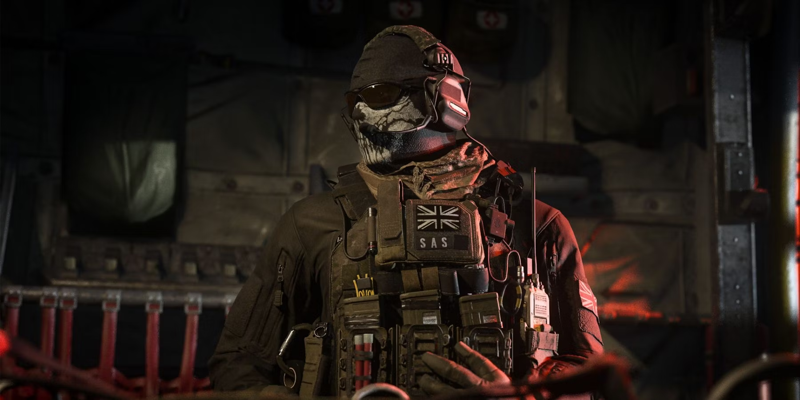

# MODERN WANFARE 3
## FECHA: 25/10/2023
## AUTOR: Álvaro Román

La historia del juego comienza directamente donde acaba el argumento de Modern Warfare 2, dejando a Estados Unidos bajo el asedio de las fuerzas rusas, el ultranacionalista Vladimir Makarov en libertad, y los capitanes «Soap» MacTavish y John Price heridos y a la fuga junto con el informante ruso Nikolai y el soldado Yuri quien juega un rol muy importante en el juego.

[Página Inicial](/index.md/)
